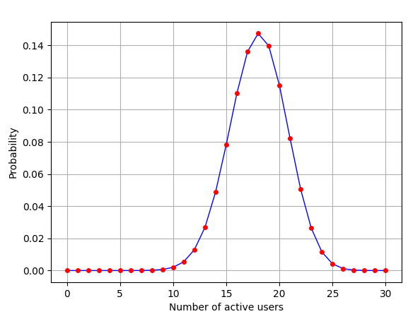

# Packet-CircuitSwitchingAnalysis
This repository contains the code of an analysis of packet and circuit switching, allowing the user to pass parameters,
such as number of connected users in the network, the link total capacity and the user active probability. And shows a visual representation of the data with a graph.

